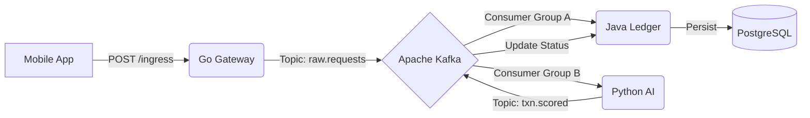

# 🛡️ Sentinel: High-Frequency Fraud Detection Platform

[](https://spring.io/)
[](https://gofiber.io/)
[](https://fastapi.tiangolo.com/)
[](https://kafka.apache.org/)
[](https://www.docker.com/)

**Sentinel** is an event-driven, polyglot financial architecture designed to detect fraud in real-time. It demonstrates the **"Fan-Out" architecture pattern**, decoupling high-velocity ingestion from ACID-compliant ledger recording.

---

## 📐 Architecture Overview

The system is composed of three specialized microservices orchestrated via **Apache Kafka**:

| Service | Technology | Role (The "Why") |
| :--- | :--- | :--- |
| **Sentinel Gateway** | **Golang** (Fiber) | **Ingestion:** Handles 10k+ TPS bursts. Validates structural integrity and buffers to Kafka. Zero logic, pure speed. |
| **Sentinel Ledger** | **Java** (Spring Boot) | **Consistency:** Consumes messages, manages Double-Entry Ledger in Postgres, and ensures ACID compliance. Implements **Retries & DLQ**. |
| **Sentinel Risk** | **Python** (Scikit-Learn) | **Intelligence:** Runs an **Isolation Forest** ML model on live transaction streams to score fraud probability. |



---

## ✨ Key Features

### 🔄 Resilience (Dead Letter Queue)
Failed messages are automatically **retried 3 times** with exponential backoff (1s → 2s → 4s). After exhausting retries, messages are routed to `raw.requests-dlt` for manual inspection.

### 📊 Observability (Prometheus + Grafana)
- **Prometheus** scrapes metrics from Spring Boot Actuator (`/actuator/prometheus`)
- **Grafana** visualizes TPS, error rates, and fraud detection statistics

### 🧠 ML-Powered Fraud Detection
An **Isolation Forest** model scores each transaction in real-time. Anomalies trigger immediate rejection.

---

## 🚀 Quick Start

```bash
# 1. Start all infrastructure (Kafka, Postgres, Gateway, Prometheus, Grafana)
docker-compose up -d

# 2. Start the Java Ledger Service
cd sentinel-ledger
./mvnw spring-boot:run

# 3. Start the Python Risk Engine
cd sentinel-risk-engine
python -m uvicorn main:app --port 8001

# 4. Send a test transaction
curl -X POST http://localhost:3000/api/v1/ingress \
  -H "Content-Type: application/json" \
  -d '{"amount": 1500, "merchantId": "STORE-001", "customerId": "CUST-123"}'
```

---

## 🌐 Service Endpoints

| Service | Port | Endpoints |
|---------|------|-----------|
| **Gateway** (Go) | 3000 | `POST /api/v1/ingress`, `GET /health` |
| **Ledger** (Java) | 8080 | `GET /api/v1/transactions/{id}`, `GET /actuator/prometheus` |
| **Risk Engine** (Python) | 8001 | `GET /health`, `POST /api/v1/score` |
| **Prometheus** | 9090 | Metrics dashboard |
| **Grafana** | 3001 | Visualization (admin/admin) |

---

## 📁 Project Structure

```
sentinel/
├── docker-compose.yml        # Infrastructure orchestration
├── prometheus.yml            # Prometheus scrape config
├── sentinel-gateway/         # Go Fiber ingestion service
│   ├── main.go
│   └── Dockerfile
├── sentinel-ledger/          # Java Spring Boot ledger
│   └── src/main/java/com/sentinel/ledger/
│       ├── listener/         # Kafka consumers (DLQ enabled)
│       ├── service/          # Business logic
│       └── entity/           # JPA entities
└── sentinel-risk-engine/     # Python ML scoring service
    ├── main.py
    └── train.py              # Model training script
```

---

## 🔧 Configuration

### Environment Variables

| Variable | Service | Default |
|----------|---------|---------|
| `KAFKA_BROKERS` | Gateway | `localhost:9092` |
| `INGRESS_TOPIC` | Gateway | `raw.requests` |
| `SPRING_PROFILES_ACTIVE` | Ledger | `default` |
| `SENTINEL_KAFKA_BOOTSTRAP_SERVERS` | Risk Engine | `localhost:9092` |

---

## 📈 Monitoring

Access **Grafana** at `http://localhost:3001` (credentials: `admin/admin`)

1. Add Prometheus data source: `http://prometheus:9090`
2. Import dashboard for Spring Boot metrics
3. Monitor: Transactions/sec, Fraud Rate, Response Times

---

## 🤝 Contributing

1. Fork the repository
2. Create a feature branch (`git checkout -b feature/amazing-feature`)
3. Commit your changes (`git commit -m 'Add amazing feature'`)
4. Push to the branch (`git push origin feature/amazing-feature`)
5. Open a Pull Request

---

## 📄 License

This project is licensed under the MIT License - see the [LICENSE](LICENSE) file for details.
